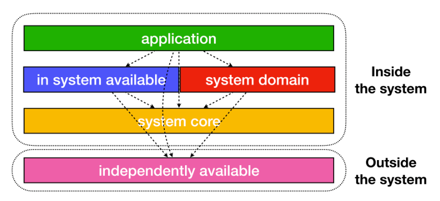

# Code-Koi Backend

## modules

### 모듈 구조
* koi-backend
  * app-koi-api
  * commons
    * common-util
    * common-model
  * core-web
  * domain
  * clients
    * koi-redis-client

---
### Application module
> 클라이언트에게 API를 제공하거나, webhook을 받는다.
* ex) koi-api-app, admin-app
* 핵심이 아니며, 해당 플랫폼에서만 제공할 것으로 예상되면 app의 Repository/Service에서 구현한다.
    * 개발 진행 중, 핵심이 되는 새로운 로직이 필요하다면 domain 모듈에서 구현한다.
* Service와 Repository는 domain의 엔티티를 참조할 수 있다.
    * 다만, Controller에서는 엔티티를 참조하면 안된다. DTO를 통해 데이터를 전달한다.

---
### Domain module
> 각 도메인의 핵심 로직을 관리한다.

* app 모듈과 무관하게 독립적인 로직을 가진다.
  * 만일 핵심이 아니며 해당 app 모듈에서만 사용된다면 그 모듈에서 구현한다.
  * 특정 API의 spec에 의존하는 쿼리가 있으면 안된다. 이러한 경우, app 모듈에서 구현한다.
* 도메인 모듈은 핵심 로직을 가지며, 도메인에 있는 유스케이스가 변경된다는 것은 다른 모듈도 변경되어야한다는 것을 의미한다.
  * 다른 ***모든*** 모듈이 변경되는 로직을 관리한다.
  * 만일, 도메인 모듈의 변경이 특정 app 모듈의 변경에 영향을 주지 않아야한다면 다른 모듈로 분리를 고민한다.
* 도메인 로직은 @Entity에서 구현한다.
  * JPA를 통해 편한 개발을 이용한다.
* service는 유스케이스마다 클래스를 분리하여 구현한다.

---
### In-system module
> app / domain 모듈을 의존하지 않는 시스템 서포트 기능을 관리한다.
* ex) core-web(JWT, filter 기능) / 외부 시스템과 통신 / event publisher

---
### Common module
> 전체 모듈에서 사용되는 공통 로직을 관리한다.
* ex) common-model, common-util
* 최대한 외부 모듈에 의존하지 않는 순수 자바 클래스를 정의한다.
  * Spring/DB 관련 의존성은 사용하지 않는다.
* 가능한 common 모듈을 사용하지 않도록 하여 모듈의 크기를 최소화한다.

---
### Independently module
> redis, sqs 기능과 같은 시스템과 무관하게 사용가능한 모듈
* ex) koi-redis-client
* 해당 모듈 자체로 독립적인 역할을 한다.

---

[이미지 참고](https://techblog.woowahan.com/2637/)